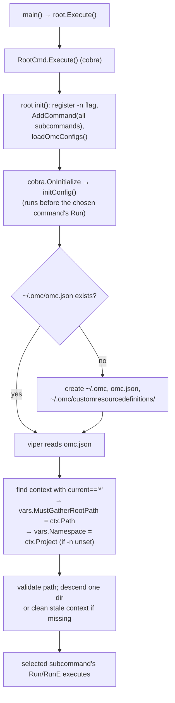
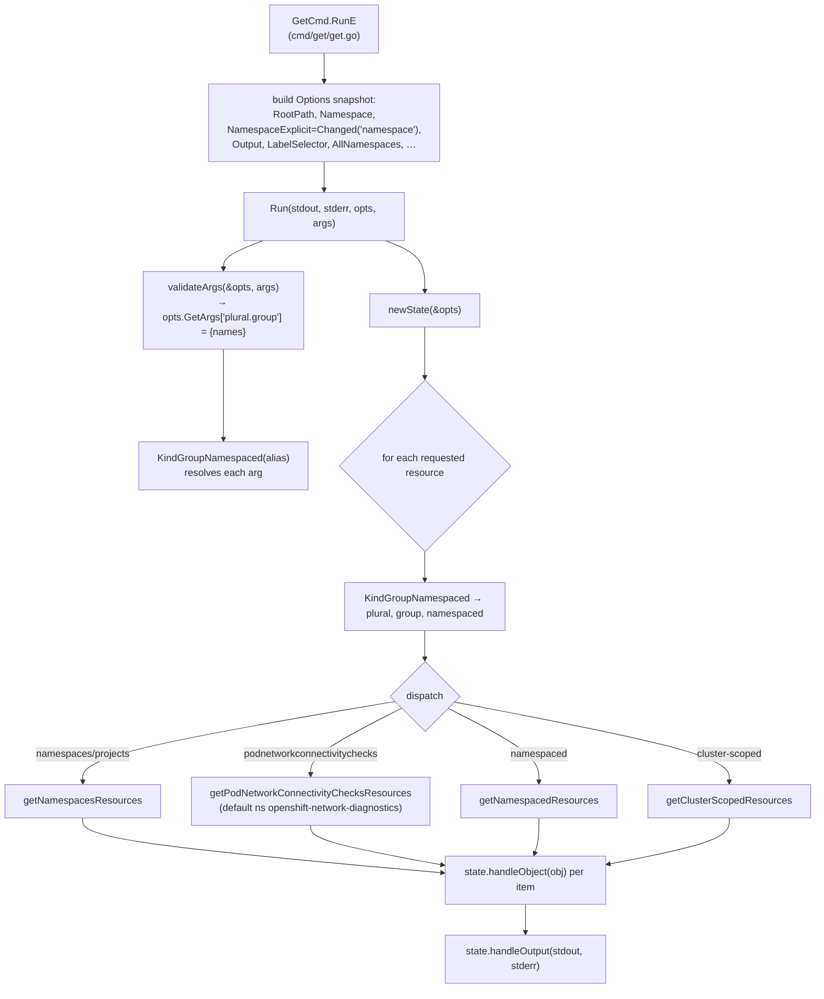
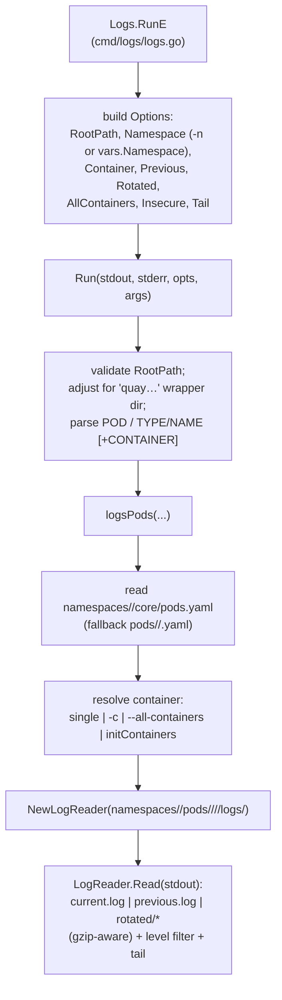

# omc — Design & Architecture

> Orientation for humans and agents. Read this before diving into the code: it maps
> the moving parts and traces two representative commands (`get` and `logs`) end to
> end, so you can find the right file without re-reading the whole tree.
>
> Symbols are given as `path/file.go:Function` — grep for them.

## What omc is

`omc` (OpenShift Must-Gather Client) is a read-only CLI that inspects a **must-gather**
(a directory dump of cluster resources and logs) the same way `oc`/`kubectl` inspect a
live cluster. There is **no API server and no network**: every command resolves to
reading YAML/log files from a must-gather directory on disk and rendering them.

It is a [Cobra](https://github.com/spf13/cobra) application. `main.go` is a 3-line
shim into the `root` package.

---

## Package map

| Path | Responsibility |
|------|----------------|
| `main.go` | Entry point → `root.Execute()`. |
| `root/` | Root cobra command, global init, config bootstrap, subcommand registration. |
| `vars/` | Process-global mutable state (active must-gather path, namespace, embedded resource table, scheme, table generator). |
| `types/` | Shared structs: on-disk config (`Config`/`Context`), unstructured list wrappers. |
| `cmd/helpers/` | Cross-cutting helpers: config file creation, table printing, label/jsonpath utilities, `Exists`. |
| `cmd/<subcommand>/` | One directory per subcommand (`get`, `logs`, `describe`, `etcd`, `network`, `certs`, …). |
| `cmd/get/known-resources.yaml` | **Embedded** (`//go:embed`) table of ~200 built-in resource aliases → plural/group/namespaced. |
| `pkg/tablegenerator/` | Turns a resource object into a `metav1.Table` (the `NAME  READY  …` grid). |
| `pkg/deserializer/` | Maps a raw object to a typed runtime object using `vars.Schema`. |

---

## Two state models (important)

omc mixes an **older global-state style** with a **newer per-invocation style**. Know
which one you are in.

1. **Global state — `vars` package** (`vars/vars.go`).
   Populated once at startup from flags + config. Most subcommands read `vars.*`
   directly (e.g. `vars.MustGatherRootPath`, `vars.Namespace`). Cobra binds the
   persistent `-n/--namespace` flag directly to `vars.Namespace`.

2. **Per-invocation state — `Options` + `state`** (currently in `cmd/get` and `cmd/logs`).
   A refactor moved the hot paths off globals:
   - Cobra flags are bound to unexported package vars (`labelSelectorFlag`, …).
   - `RunE` **snapshots** those vars + `vars.*` into an `Options` struct.
   - A pure `Run(stdout, stderr io.Writer, opts Options, args []string)` does the work,
     taking its output writers as parameters and reading config only from `opts`
     (e.g. `opts.RootPath` instead of `vars.MustGatherRootPath`).
   - `get` additionally carries a `state` accumulator (`cmd/get/get.go:state`) so the
     pipeline is reentrant.

   **Convention for new work in these packages:** read flags/globals only in `RunE`,
   pass everything else through `Options`; never read `vars.*` inside `Run` or below.
   `Options.NamespaceExplicit` exists because `initConfig` fills `vars.Namespace` from
   the context project even when `-n` was not passed — so "was `-n` given?" can only be
   answered by `cmd.Root().PersistentFlags().Changed("namespace")`, captured in `RunE`.

---

## The config file: `~/.omc/omc.json`

Schema is `types.Config` (`types/types.go`):

```jsonc
{
  "id": "<active context id>",
  "contexts": [
    { "id": "ab12cd34", "path": "/abs/path/to/must-gather-root",
      "current": "*",            // "*" marks the ACTIVE context (only one)
      "project": "openshift-etcd" } // remembered namespace for this context
  ],
  "use_local_crds": false,        // also consult ~/.omc/customresourcedefinitions/
  "diff_command": "",             // external differ for `omc mc diff`
  "default_project": "default"    // fallback namespace
}
```

`omc use` writes it; every command reads it at startup to learn which must-gather is
active and which namespace to default to.

---

## Lifecycle: install → first call → dispatch



Key code:
- `root/root.go:init` — registers the persistent `-n/--namespace` flag (bound to
  `vars.Namespace`), registers every subcommand, hides klog flags, calls
  `loadOmcConfigs`.
- `root/root.go:initConfig` — the cobra `OnInitialize` hook. Ensures `~/.omc/omc.json`
  and `~/.omc/customresourcedefinitions/` exist (`helpers.CreateConfigFile`), reads the
  config, resolves the **active context** (`Current == "*"`) into
  `vars.MustGatherRootPath` and `vars.Namespace`, and self-heals a path that points one
  level above the real root or no longer exists.
- `root/root.go:loadOmcConfigs` — copies `use_local_crds`, `diff_command`,
  `default_project` into `vars`.

On a fresh install the first invocation just creates the config; nothing is "active"
until the user runs `omc use`.

### `omc use <path|tarball|url>` — selecting a must-gather

`cmd/use/use.go:UseCmd`:
1. If the arg is a URL/compressed file, download/extract it (reusing a prior extraction
   if already registered).
2. `findMustGatherIn` locates the **real root** — the directory that directly contains
   `namespaces/` or `cluster-scoped-resources/` — descending through single
   wrapper directories as needed.
3. `useContext` rewrites `omc.json`: marks this path `current:"*"`, picks the project
   (the single namespace if the must-gather has exactly one, else `default_project`),
   and persists it.
4. `MustGatherInfo` prints a summary (reads `infrastructures.yaml` and
   `clusterversions/version.yaml` for cluster id / version).

After this, `initConfig` on subsequent runs will pick up the active context
automatically.

---

## Must-gather on-disk layout (what the readers expect)

```
<must-gather-root>/
├── timestamp
├── cluster-scoped-resources/
│   └── <group>/<plural>.yaml                 # cluster-scoped lists, e.g. config.openshift.io/...
│   └── apiextensions.k8s.io/customresourcedefinitions/*.yaml   # CRDs → dynamic alias discovery
├── namespaces/
│   └── <namespace>/
│       ├── core/pods.yaml                     # aggregated List of pods (may be empty)
│       ├── <group>/<plural>.yaml              # aggregated List for built-in kinds
│       ├── <group>/<plural>/<name>.yaml       # one file per object (custom resources)
│       └── pods/<pod>/<container>/<container>/logs/{current,previous,rotated/…}.log
└── pod_network_connectivity_check/podnetworkconnectivitychecks.yaml
```

Two storage shapes matter: **aggregated** (`<plural>.yaml` = a `kind: List`) vs
**per-object** (one YAML per resource in a directory). The readers try aggregated
first and fall back to per-object (and pods have a special empty-file fallback).

---

## Flow 1 — `omc get <resource> [name…]`



Step by step:

1. **`cmd/get/get.go:GetCmd.RunE`** — snapshots flags/globals into `Options`
   (including `RootPath` = `vars.MustGatherRootPath` and `NamespaceExplicit`) and calls
   `Run`.
2. **`Run`** (`cmd/get/get.go:Run`) — sets `Wide` from `-o wide`, calls `validateArgs`,
   creates the `state`, loops over requested resources, dispatches, then
   `handleOutput`. Pure w.r.t. I/O (writers are parameters).
3. **`cmd/get/helpers.go:validateArgs`** — parses the CLI arg forms into
   `opts.GetArgs`, a map keyed by `"<plural>.<group>"` → set of requested names:
   - `all` → a canned list of common workload kinds.
   - `a,b,c` (comma list) → multiple kinds, sets `ShowKind`.
   - `type/name` → one kind, one name (sets `SingleResource` when single).
   - `type name1 name2` → one kind, several names.
   Every alias is resolved via `KindGroupNamespaced`; unknown → `resource type "x" not known`.
4. **`cmd/get/helpers.go:KindGroupNamespaced`** — alias → `(plural, group, singular, namespaced)`.
   Resolution order:
   1. embedded `vars.KnownResources` (from `known-resources.yaml`), matching `plural`
      or `plural.group`;
   2. `vars.AliasToCrd` cache;
   3. `kindGroupNamespacedFromCrds` — scans the must-gather
      `cluster-scoped-resources/apiextensions.k8s.io/customresourcedefinitions/`, then
      (if `use_local_crds`) `~/.omc/customresourcedefinitions/`, matching kind/plural/
      singular/shortnames and **caching** hits into `vars.AliasToCrd`.
   > This is why CRs work without being hardcoded: their type is discovered from the
   > CRDs shipped inside the must-gather.
5. **Readers** (`getNamespacedResources`, `getClusterScopedResources`,
   `getNamespacesResources`, `getPodNetworkConnectivityChecksResources`) — build the
   file path from `s.opts.RootPath` + layout, read the aggregated `<plural>.yaml` list
   (falling back to a per-object directory, and a per-pod fallback when `core/pods.yaml`
   is empty), unmarshal to `unstructured.Unstructured`, optionally `sortResources`,
   filter by the requested name set, and call `state.handleObject` per item.
   For `-A`, `getNamespacedResources` iterates every directory under `namespaces/`.
6. **`cmd/get/get.go:state.handleObject`** — the per-object funnel:
   - drops objects whose namespace ≠ `s.opts.Namespace` (unless empty/`-A`);
   - applies the label selector (`helpers.MatchLabelsFromMap`);
   - `-o yaml|json|jsonpath` → accumulate into `unstructuredList`/`jsonPathList`;
   - `-o name` → write `kind/name` lines;
   - otherwise build a `metav1.Table` and append rows, grouping consecutive rows by
     kind. Table generation picks one of three paths:
     - `-o custom-columns=` → `tablegenerator.CustomColumnsTable`;
     - **known** kind → `deserializer.RawObjectToRuntimeObject` (typed via `vars.Schema`)
       then `tablegenerator.InternalResourceTable` (reuses upstream kubectl printers);
     - **unknown/CR** → `tablegenerator.GenerateCustomResourceTable`.
7. **`cmd/get/get.go:state.handleOutput`** — flushes the built table or the
   accumulated yaml/json/jsonpath list to `stdout`, or prints
   `No resources … found[in <ns> namespace]` to `stderr`.

---

## Flow 2 — `omc logs (POD | TYPE/NAME) [CONTAINER]`



Step by step:

1. **`cmd/logs/logs.go:Logs.RunE`** — resolves the namespace (`-n` overrides
   `vars.Namespace`), snapshots into `Options`, calls `Run`.
2. **`cmd/logs/logs.go:Run`** — validates `opts.RootPath`, handles a `quay…` wrapper
   directory, and parses the positional args: `POD` or `pod/NAME`, with an optional
   second `CONTAINER` arg (mutually exclusive with `-c`). Delegates to `logsPods`.
3. **`cmd/logs/pods.go:logsPods`** — reads `namespaces/<ns>/core/pods.yaml` (fallback:
   `namespaces/<ns>/pods/<pod>/<pod>.yaml` when the aggregated file is empty),
   finds the pod, and resolves the container:
   - exactly one container and no `-c` → that container;
   - `--all-containers` → loop all;
   - else match `-c`/inline name against containers **and** init containers.
   For each selected container it builds a `LogReader` rooted at
   `namespaces/<ns>/pods/<pod>/<container>/<container>/logs/`.
4. **`cmd/logs/logreader.go:LogReader`** — reads log files from that directory:
   `current.log` by default, `previous.log` with `-p`, the `rotated/` set with `-r`,
   and `*.insecure.log` siblings with `--insecure`. `open` transparently handles
   gzip-compressed rotated files. A CRI log-level filter
   (`cmd/logs/filter.go` / `crio.go`, from `-l info,error,…`) and `--tail N` are applied
   line by line. Output goes to `stdout`.

---

## Conventions & gotchas for contributors/agents

- **No network, ever.** Everything is file I/O under a must-gather root. If you need a
  resource, it must exist on disk in the expected layout.
- **Namespace defaulting is subtle.** `vars.Namespace` is set to the active context's
  project by `initConfig` even without `-n`. In `get`/`logs`, prefer
  `opts.NamespaceExplicit` (from `Changed("namespace")`) over comparing
  `Namespace == ""`.
- **Resource resolution is layered:** embedded `known-resources.yaml` → `AliasToCrd`
  cache → CRDs inside the must-gather → `~/.omc/customresourcedefinitions/` (only when
  `use_local_crds`). Adding a built-in alias means editing `known-resources.yaml`; CRs
  need no code.
- **Two storage shapes** per kind (aggregated `List` file vs per-object directory) —
  new readers should handle both, plus the empty-`core/pods.yaml` fallback.
- **`get` and `logs` follow the `Options`/`Run` pattern.** Read flags only in `RunE`,
  keep `Run` pure, take writers as parameters. Older subcommands still read `vars.*`
  and call `os.Exit` directly; new code should return errors (`SilenceUsage: true` is
  set on `get`/`logs`).
- **Table rendering has three paths** (custom-columns, typed-via-scheme, generic CR).
  Typed rendering reuses upstream kubectl/openshift printers registered into
  `vars.TableGenerator` and `vars.Schema` in `cmd/get/get.go`'s `init`.
